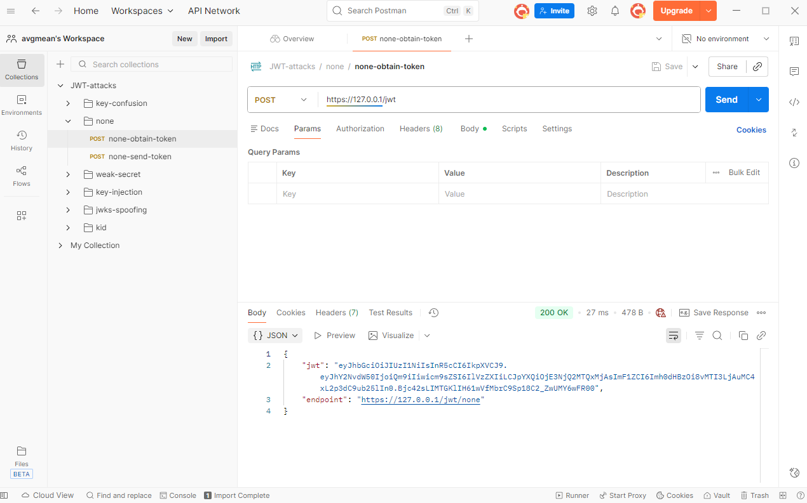
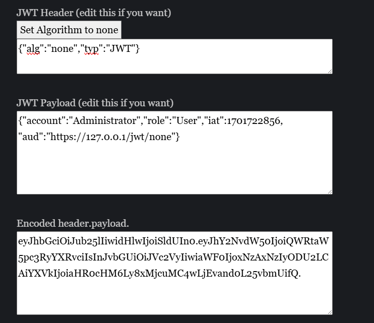

## Zadanie 1 - Przygotowanie rozszerzonego zestawu testów jednostowych
Przygotowano testy, które sprawdzają:
- Testy poprawnych danych 
- Testy niepoprawnych danych
- Testy związane z próbą wstrzyknięcia kodu SQL oraz kodu JavaScript
- Testy ekstremalne
Testy napisano dla modelu customers.

Sprawdzono takie rzeczy jak:
- czy klient został poprawnie stworzony
- czy podany wiek jest możliwy
- sql injection
- js injection
- przypadek, gdy dane nie zostaną wprowadzone
- ekstremalnie długi string
- czy pesel jest wyjątkowy
Zgodnie z oczekiwaniami, testy nie przechodzą i otrzymujemy mnóstwo błędów.

--- 

## Zadanie 2 - ## JWT — wykorzystanie podatności oraz realizacja poprawki
Zadanie rozpoczęto od wgrania kolekcji do Postmana oraz wygenerowaniu tokena dla Boba


Przygotowany token zgodnie ze stroną https://www.gavinjl.me/edit-jwt-online-alg-none/:
eyJhbGciOiJub25lIiwidHlwIjoiSldUIn0.eyJhY2NvdW50IjoiQWRtaW5pc3RyYXRvciIsInJvbGUiOiJVc2VyIiwiaWF0IjoxNzAxNzIyODU2LCAiYXVkIjoiaHR0cHM6Ly8xMjcuMC4wLjEvand0L25vbmUifQ.



Po przesłaniu tokenu otrzymano szukany komunikat.

Poprawka:
Usunięcie none z dostępnych algorytmów z
```
    JWT.verify(jwt_token, secret_key, { algorithms: ['HS256'], complete: true, audience: 'https://127.0.0.1/jwt/none' }, (err, decoded_token) => {
```
